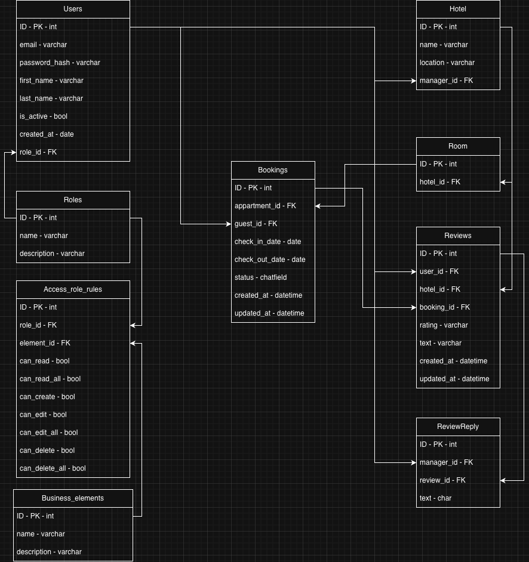

# Hotel Auth - Система аутентификации и авторизации

Backend-приложение с собственной системой аутентификации и авторизации для отельного бизнеса.

## Стек технологий

- Django + Django REST Framework
- PostgreSQL
- bcrypt - хеширование паролей
- PyJWT - JWT токены

## Установка и запуск

1. Клонируйте репозиторий
2. Установите зависимости:
Через pipenv:
```bash
pipenv install
```

Или через pip:
```bash
pip install -r requirements.txt
```
3. Создайте `.env` файл по примеру `.env.example`
4. Выполните миграции:
```bash
python manage.py migrate
```
5. Загрузите начальные данные:
```bash
python manage.py loaddata api/fixtures/initial_role_data.json
python manage.py loaddata api/fixtures/initial_business_elements_data.json
python manage.py loaddata api/fixtures/initial_access_rules_admin.json
python manage.py loaddata api/fixtures/initial_access_rules_hotel_manager.json
python manage.py loaddata api/fixtures/initial_access_rules_receptionist.json
python manage.py loaddata api/fixtures/initial_access_rules_guest.json
```
6. Запустите сервер:
```bash
python manage.py runserver
```

## Схема системы прав доступа

### Роли
- **admin** - полный доступ ко всем ресурсам
- **hotel_manager** - управление своим отелем, просмотр бронирований и отзывов
- **receptionist** - управление бронированиями, просмотр гостей и отзывов
- **guest** - создание бронирований и отзывов, просмотр своих данных

### Бизнес элементы
Каждый ресурс системы представлен как бизнес элемент: `user`, `hotel`, `room`, `booking`, `review`, `reviewReply`, `role`, `accessRoleRules`

### Таблица прав (AccessRoleRule)
Для каждой комбинации роли и бизнес элемента хранятся флаги:
- `can_read` - читать свои объекты
- `can_read_all` - читать все объекты
- `can_create` - создавать объекты
- `can_edit` - редактировать свои объекты
- `can_edit_all` - редактировать все объекты
- `can_delete` - удалять свои объекты
- `can_delete_all` - удалять все объекты

### Таблица прав доступа

| Элемент | admin | hotel_manager | receptionist | guest |
|---------|-------|---------------|--------------|-------|
| user | все права | can_read, can_edit, can_delete | can_read, can_edit, can_delete | can_read, can_edit, can_delete |
| hotel | все права | can_read, can_read_all, can_edit | — | — |
| room | все права | can_read, can_edit | can_read, can_read_all| — |
| booking | все права | can_read, can_read_all | can_create, can_read, can_read_all, can_edit, can_delete | can_create, can_read |
| review | все права | can_read, can_read_all | can_read, can_read_all | can_create, can_read, can_read_all, can_edit |
| reviewReply | все права | can_create, can_read, can_read_all, can_edit | can_read, can_read_all | can_read, can_read_all|
| role | все права | — | — | — |
| accessRoleRules | все права | — | — | — |

> Примечание: `can_edit` - редактирование своих объектов, `can_edit_all` - редактирование всех объектов. В текущей реализации используются Mock Views без реальных объектов в базе данных, поэтому разграничение "своё/чужое" не реализовано на уровне бизнес-логики во views.

### Диаграмма базы данных



### Как работает авторизация
1. Пользователь отправляет запрос с JWT токеном в заголовке `Authorization: Bearer <token>`
2. Middleware декодирует токен и записывает пользователя в `request.auth_user`
3. Каждая view проверяет права через `check_permission(user, element, action)`
4. Если права есть - возвращает данные
5. Если нет токена - `401 Unauthorized`
6. Если нет прав - `403 Forbidden`

## Endpoints

### Аутентификация
| Метод | URL | Описание |
|-------|-----|----------|
| POST | `/auth/register/` | Регистрация |
| POST | `/auth/login/` | Вход, возвращает токен |
| POST | `/auth/logout/` | Выход |
| GET | `/auth/profile/` | Просмотр профиля |
| PATCH | `/auth/profile/update/` | Обновление профиля - имя/фамилия/email |
| PATCH | `/auth/password/change/` | Смена пароля |
| DELETE | `/auth/profile/delete/` | Мягкое удаление аккаунта |

### API (только для admin)
| Метод | URL | Описание |
|-------|-----|----------|
| GET | `/api/roles/` | Список ролей |
| PATCH | `/api/roles/<id>/` | Обновление роли |
| DELETE | `/api/roles/<id>/` | Удаление роли |
| GET | `/api/access-rules/` | Список правил доступа |
| PATCH | `/api/access-rules/<id>/` | Изменение правила |
| GET | `/api/users/` | Список пользователей |
| GET | `/api/users/<id>/` | Просмотр пользователя |
| PATCH | `/api/users/<id>/` | Редактирование пользователя |
| DELETE | `/api/users/<id>/` | Деактивация пользователя |

### Mock endpoints
| Метод | URL | Описание |
|-------|-----|----------|
| GET/POST | `/api/mock/hotels/` | Список отелей |
| GET/PATCH/DELETE | `/api/mock/hotels/<id>/` | Детали отеля |
| GET/POST | `/api/mock/rooms/` | Список номеров |
| GET/PATCH/DELETE | `/api/mock/rooms/<id>/` | Детали номера |
| GET/POST | `/api/mock/bookings/` | Список бронирований |
| GET/PATCH/DELETE | `/api/mock/bookings/<id>/` | Детали бронирования |
| GET/POST | `/api/mock/reviews/` | Список отзывов |
| GET/PATCH/DELETE | `/api/mock/reviews/<id>/` | Детали отзыва |
| GET/POST | `/api/mock/review-replies/` | Список ответов на отзывы |
| GET/PATCH/DELETE | `/api/mock/review-replies/<id>/` | Детали ответа |